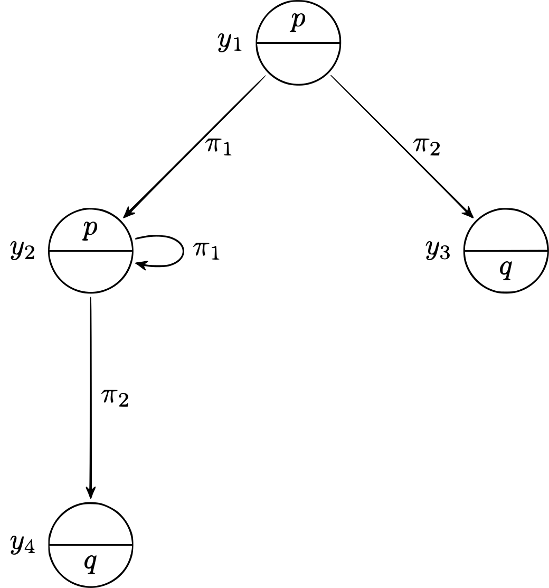

# **Marp**

Markdown Presentation Ecosystem

https://marp.app/

--- 

# Syntax - Formulas

Given $\Phi_0$ the set of _atomic formulas_, for any $\phi, \psi \in \Phi_0$
- $\phi \in \mathrm{Form}(\Phi_0)$
- $\lnot \phi \in \mathrm{Form}(\Phi_0)$
- $\phi \lor \psi \in \mathrm{Form}(\Phi_0)$
- $[\alpha] \phi \in \mathrm{Form}(\Phi_0)$

where $\alpha \in \mathrm{Prog}(\Pi_0)$

---

# Syntax - Programs

Given $\Pi_0$ the set of _atomic programs_, for any $\alpha, \beta \in \Pi_0$

- $\alpha \in \mathrm{Prog}(\Pi_0)$
- $(\alpha; \beta) \in \mathrm{Prog}(\Pi_0)$
- $(\alpha \cup \beta) \in \mathrm{Prog}(\Pi_0)$
- $\alpha^* \in \mathrm{Prog}(\Pi_0)$
- $\phi? \in \mathrm{Prog}(\Pi_0)$

where $\phi \in \mathrm{Form}(\Phi_0)$

---

# Syntax - Relations

$$(x, y) \in R(\pi) \iff x \stackrel{\pi}{\to} y$$

- $(x, y) \in R(\alpha; \beta) \iff \exists z \in W \quad (x, z) \in R(\alpha) \land (z, y) \in R(\beta)$
- $(x, y) \in R(\alpha \cup \beta) \iff (x, y) \in R(\alpha) \lor (x, y) \in R(\beta)$
- $(x, y) \in R(\alpha^*) \iff \exists z_0, \ldots, z_n \in W \quad \left \{\begin{array}{l}z_0 = x \\ z_n = y \\ (z_{k - 1}, z_k) \in R(\alpha) \end{array}\right.$
- $(x, y) \in R(\phi?) \iff x = y \land y \in V(\phi)$

---

# Syntax - Valuations

$$x \in V(p) \iff p \ \mbox{is true at} \ x$$

- $V(\bot) = \varnothing$
- $V(\top) = W$
- $V(\lnot \phi) = W - V(\phi)$
- $V(\phi \lor \psi) = V(\phi) \cup V(\psi)$
- $V([\alpha] \phi) = \{x \mid \forall y \in W \quad (x, y) \in R(\alpha) \implies y \in V(\phi)\}$

---

# LTS

  

&nbsp;&nbsp;&nbsp;&nbsp;&nbsp;&nbsp;&nbsp;&nbsp;&nbsp;&nbsp;&nbsp;&nbsp;&nbsp;&nbsp;&nbsp;&nbsp;&nbsp;&nbsp;&nbsp;&nbsp;&nbsp;&nbsp;&nbsp;&nbsp;&nbsp;&nbsp;&nbsp;&nbsp;&nbsp;&nbsp;&nbsp;&nbsp;&nbsp;&nbsp;&nbsp;&nbsp;&nbsp;&nbsp;&nbsp;&nbsp;&nbsp;&nbsp;&nbsp;&nbsp;&nbsp;&nbsp;&nbsp;&nbsp;&nbsp;&nbsp;&nbsp;&nbsp;&nbsp;&nbsp;&nbsp;&nbsp;&nbsp;&nbsp;&nbsp;&nbsp;&nbsp;&nbsp;&nbsp;&nbsp;&nbsp;&nbsp;&nbsp;&nbsp;&nbsp;&nbsp;&nbsp;&nbsp; • $W = \{y_1, y_2, y_3, y_4\}$
&nbsp;&nbsp;&nbsp;&nbsp;&nbsp;&nbsp;&nbsp;&nbsp;&nbsp;&nbsp;&nbsp;&nbsp;&nbsp;&nbsp;&nbsp;&nbsp;&nbsp;&nbsp;&nbsp;&nbsp;&nbsp;&nbsp;&nbsp;&nbsp;&nbsp;&nbsp;&nbsp;&nbsp;&nbsp;&nbsp;&nbsp;&nbsp;&nbsp;&nbsp;&nbsp;&nbsp;&nbsp;&nbsp;&nbsp;&nbsp;&nbsp;&nbsp;&nbsp;&nbsp;&nbsp;&nbsp;&nbsp;&nbsp;&nbsp;&nbsp;&nbsp;&nbsp;&nbsp;&nbsp;&nbsp;&nbsp;&nbsp;&nbsp;&nbsp;&nbsp;&nbsp;&nbsp;&nbsp;&nbsp;&nbsp;&nbsp;&nbsp;&nbsp;&nbsp;&nbsp;&nbsp;&nbsp; • $R(\pi_1) = \{(y_1, y_2), (y_2, y_2)\}$
&nbsp;&nbsp;&nbsp;&nbsp;&nbsp;&nbsp;&nbsp;&nbsp;&nbsp;&nbsp;&nbsp;&nbsp;&nbsp;&nbsp;&nbsp;&nbsp;&nbsp;&nbsp;&nbsp;&nbsp;&nbsp;&nbsp;&nbsp;&nbsp;&nbsp;&nbsp;&nbsp;&nbsp;&nbsp;&nbsp;&nbsp;&nbsp;&nbsp;&nbsp;&nbsp;&nbsp;&nbsp;&nbsp;&nbsp;&nbsp;&nbsp;&nbsp;&nbsp;&nbsp;&nbsp;&nbsp;&nbsp;&nbsp;&nbsp;&nbsp;&nbsp;&nbsp;&nbsp;&nbsp;&nbsp;&nbsp;&nbsp;&nbsp;&nbsp;&nbsp;&nbsp;&nbsp;&nbsp;&nbsp;&nbsp;&nbsp;&nbsp;&nbsp;&nbsp;&nbsp;&nbsp;&nbsp; • $R(\pi_2) = \{(y_1, y_3), (y_2, y_4)\}$
&nbsp;&nbsp;&nbsp;&nbsp;&nbsp;&nbsp;&nbsp;&nbsp;&nbsp;&nbsp;&nbsp;&nbsp;&nbsp;&nbsp;&nbsp;&nbsp;&nbsp;&nbsp;&nbsp;&nbsp;&nbsp;&nbsp;&nbsp;&nbsp;&nbsp;&nbsp;&nbsp;&nbsp;&nbsp;&nbsp;&nbsp;&nbsp;&nbsp;&nbsp;&nbsp;&nbsp;&nbsp;&nbsp;&nbsp;&nbsp;&nbsp;&nbsp;&nbsp;&nbsp;&nbsp;&nbsp;&nbsp;&nbsp;&nbsp;&nbsp;&nbsp;&nbsp;&nbsp;&nbsp;&nbsp;&nbsp;&nbsp;&nbsp;&nbsp;&nbsp;&nbsp;&nbsp;&nbsp;&nbsp;&nbsp;&nbsp;&nbsp;&nbsp;&nbsp;&nbsp;&nbsp;&nbsp; • $V(p) = \{y_1, y_2\}$
&nbsp;&nbsp;&nbsp;&nbsp;&nbsp;&nbsp;&nbsp;&nbsp;&nbsp;&nbsp;&nbsp;&nbsp;&nbsp;&nbsp;&nbsp;&nbsp;&nbsp;&nbsp;&nbsp;&nbsp;&nbsp;&nbsp;&nbsp;&nbsp;&nbsp;&nbsp;&nbsp;&nbsp;&nbsp;&nbsp;&nbsp;&nbsp;&nbsp;&nbsp;&nbsp;&nbsp;&nbsp;&nbsp;&nbsp;&nbsp;&nbsp;&nbsp;&nbsp;&nbsp;&nbsp;&nbsp;&nbsp;&nbsp;&nbsp;&nbsp;&nbsp;&nbsp;&nbsp;&nbsp;&nbsp;&nbsp;&nbsp;&nbsp;&nbsp;&nbsp;&nbsp;&nbsp;&nbsp;&nbsp;&nbsp;&nbsp;&nbsp;&nbsp;&nbsp;&nbsp;&nbsp;&nbsp; • $V(q) = \{y_3, y_4\}$

---

# LTS

  

&nbsp;&nbsp;&nbsp;&nbsp;&nbsp;&nbsp;&nbsp;&nbsp;&nbsp;&nbsp;&nbsp;&nbsp;&nbsp;&nbsp;&nbsp;&nbsp;&nbsp;&nbsp;&nbsp;&nbsp;&nbsp;&nbsp;&nbsp;&nbsp;&nbsp;&nbsp;&nbsp;&nbsp;&nbsp;&nbsp;&nbsp;&nbsp;&nbsp;&nbsp;&nbsp;&nbsp;&nbsp;&nbsp;&nbsp;&nbsp;&nbsp;&nbsp;&nbsp;&nbsp;&nbsp;&nbsp;&nbsp;&nbsp;&nbsp;&nbsp;&nbsp;&nbsp;&nbsp;&nbsp;&nbsp;&nbsp;&nbsp;&nbsp;&nbsp;&nbsp;&nbsp;&nbsp;&nbsp;&nbsp;&nbsp;&nbsp;&nbsp;&nbsp;&nbsp;&nbsp;&nbsp;&nbsp; • $\mathfrak M, y_1 \models \left\langle\pi_1^*; \pi_2 \right \rangle q$
&nbsp;&nbsp;&nbsp;&nbsp;&nbsp;&nbsp;&nbsp;&nbsp;&nbsp;&nbsp;&nbsp;&nbsp;&nbsp;&nbsp;&nbsp;&nbsp;&nbsp;&nbsp;&nbsp;&nbsp;&nbsp;&nbsp;&nbsp;&nbsp;&nbsp;&nbsp;&nbsp;&nbsp;&nbsp;&nbsp;&nbsp;&nbsp;&nbsp;&nbsp;&nbsp;&nbsp;&nbsp;&nbsp;&nbsp;&nbsp;&nbsp;&nbsp;&nbsp;&nbsp;&nbsp;&nbsp;&nbsp;&nbsp;&nbsp;&nbsp;&nbsp;&nbsp;&nbsp;&nbsp;&nbsp;&nbsp;&nbsp;&nbsp;&nbsp;&nbsp;&nbsp;&nbsp;&nbsp;&nbsp;&nbsp;&nbsp;&nbsp;&nbsp;&nbsp;&nbsp;&nbsp;&nbsp; • $\mathfrak M, y_2 \models \left[\pi_1^*\right]p$
&nbsp;&nbsp;&nbsp;&nbsp;&nbsp;&nbsp;&nbsp;&nbsp;&nbsp;&nbsp;&nbsp;&nbsp;&nbsp;&nbsp;&nbsp;&nbsp;&nbsp;&nbsp;&nbsp;&nbsp;&nbsp;&nbsp;&nbsp;&nbsp;&nbsp;&nbsp;&nbsp;&nbsp;&nbsp;&nbsp;&nbsp;&nbsp;&nbsp;&nbsp;&nbsp;&nbsp;&nbsp;&nbsp;&nbsp;&nbsp;&nbsp;&nbsp;&nbsp;&nbsp;&nbsp;&nbsp;&nbsp;&nbsp;&nbsp;&nbsp;&nbsp;&nbsp;&nbsp;&nbsp;&nbsp;&nbsp;&nbsp;&nbsp;&nbsp;&nbsp;&nbsp;&nbsp;&nbsp;&nbsp;&nbsp;&nbsp;&nbsp;&nbsp;&nbsp;&nbsp;&nbsp;&nbsp; • $\mathfrak M, y_1 \models \left [ \pi_1 \cup \pi_2 \right ] (p \lor q)$
&nbsp;&nbsp;&nbsp;&nbsp;&nbsp;&nbsp;&nbsp;&nbsp;&nbsp;&nbsp;&nbsp;&nbsp;&nbsp;&nbsp;&nbsp;&nbsp;&nbsp;&nbsp;&nbsp;&nbsp;&nbsp;&nbsp;&nbsp;&nbsp;&nbsp;&nbsp;&nbsp;&nbsp;&nbsp;&nbsp;&nbsp;&nbsp;&nbsp;&nbsp;&nbsp;&nbsp;&nbsp;&nbsp;&nbsp;&nbsp;&nbsp;&nbsp;&nbsp;&nbsp;&nbsp;&nbsp;&nbsp;&nbsp;&nbsp;&nbsp;&nbsp;&nbsp;&nbsp;&nbsp;&nbsp;&nbsp;&nbsp;&nbsp;&nbsp;&nbsp;&nbsp;&nbsp;&nbsp;&nbsp;&nbsp;&nbsp;&nbsp;&nbsp;&nbsp;&nbsp;&nbsp;&nbsp; • $\mathfrak M, y_3 \models \left [ \pi_1 \cup \pi_2 \right ] \bot$

---

# Axiomatization - Validity

We write $\mathfrak M, w \models \phi$ if and only if $w \in V(\phi)$

$\phi$ is _valid_ in $\mathfrak M$, written as $\mathfrak M \models \phi$, if and only if

$$\mathfrak M \models \phi \iff \forall w \in W \quad \mathfrak M, w \models \phi$$

$\phi$ is **valid**, written as $\models \phi$, if and only if

$$\models \phi \iff \forall \mathfrak M \quad \mathfrak M \models \phi$$

---

# Axiomatization - Goal

The goal is to define a **decudibility predicate** $\vdash$ such that
$\vdash$-deductions are both _sound_ and _complete_ in terms of validity, i.e. for any $\phi$ it holds that

$$\vdash \phi \iff \models \phi$$

---

# Axiomatization - K and N axioms

$$
    \begin{equation*}
        \begin{alignedat}{2}
            (\mbox K) & \quad \quad && [\alpha] (\phi \to \psi) \to ([\alpha] \phi \to [\alpha] \psi) \\
            (\mbox N) & \quad \quad && \dfrac{\phi}{[\pi] \phi} \\
        \end{alignedat}
    \end{equation*}
$$

A modal logic is **normal** if it obeys $(\mbox K)$ and $(\mbox N)$

---

# Axiomatization - PDL axioms

PDL is the _least normal_ modal logic containing every instance of

$$
    \begin{equation*}
        \begin{alignedat}{2}
            (\mbox A 1) & \quad \quad && [\alpha ; \beta] \phi \leftrightarrow [ \alpha ] [\beta] \phi \\
            (\mbox A 2) & \quad \quad && [\alpha \cup \beta] \phi \leftrightarrow [ \alpha] \phi \land [\beta] \phi \\
            (\mbox A 3) & \quad \quad && [\alpha ^*] \phi \leftrightarrow \phi \land [\alpha] [\alpha ^*] \phi \\
            (\mbox A 4) & \quad \quad && [\phi?] \psi \leftrightarrow (\phi \to \psi) \\
        \end{alignedat}
    \end{equation*}
$$

and closed under the _loop invariance_ rule of inference

$$(\mbox I) \quad \quad \dfrac{\phi \to [\alpha] \phi}{\phi \to [\alpha^*] \phi}$$

---

# Axiomatization - $\vdash$-deducibility

A formula $\phi$ is $\vdash$-_deducible_ from $\Sigma \subseteq \mathrm{Form}(\Phi_0)$ if there exists a sequence $\phi_0, \ldots, \phi_n$ such that $\phi_n = \phi$, and for all $i \in [n]$

- $\phi_i$ is an instance of an axiom schema
- $\phi_i$ is an instance of a formula of $\Sigma$
- $\phi_i$ comes from earlier formulas of the sequence by inference

Are $\vdash$-deductions sound and complete?

---

# Completeness - Segerberg's axioms

In 1977 Segerberg proposed to replace

$$(\mbox I) \quad \quad \dfrac{\phi \to [\alpha] \phi}{\phi \to [\alpha^*] \phi}$$

with the following fifth axiom

$$(\mbox A 5) \quad \quad \phi \land [\alpha^*] (\phi \to [\alpha] \phi) \to [\alpha^*]\phi$$

in order to prove that such axiomatization was sound and complete

---

# Completeness - Segerberg's axioms

Indeed, it is easy to prove that $(\mbox I)$ can be replaced with $(\mbox A 5)$

$$
    \begin{equation*}
        \begin{alignedat}{2}
            1. \vdash & \ \phi \to [\alpha] \phi && \quad \quad \mbox{(premise)} \\
            2. \vdash & \ [\alpha ^*](\phi \to [\alpha] \phi) && \quad \quad \mbox{(from 1 using (N) with } \pi = \alpha^*) \\
            3. \vdash & \ \phi \land [\alpha ^*] (\phi \to [\alpha] \phi) \to [\alpha^*] \phi && \quad \quad (\mbox A 5) \\
            4. \vdash & \ [\alpha^*](\phi \to [\alpha] \phi) \to (\phi \to [\alpha^*] \phi) && \quad \quad (\mbox{from 3 through prop. reasoning}) \\
            5. \vdash & \ \phi \to [\alpha^*] \phi && \quad \quad (\mbox{from 2 and 4 using \textit{Modus Ponens}})
        \end{alignedat}
    \end{equation*}
$$

---

# Completeness

To prove that $\vdash$ is sound w.r.t. $\models$, i.e. that

$$\vdash \phi \implies \models \phi$$

a proof by induction on the length of $\phi$'s deduction in $\vdash$ suffices.

So, what about completeness? It requires to prove that

$$\models \phi \implies \vdash \phi$$

---

# Completeness

Segerberg's work was the first attempt to prove the completeness of $\vdash$, however in 1978 he found a flaw in his argument.

Then in the same year Parikh published what is now considered the first proof of the completeness of $\vdash$.

---

# Completeness - Goldblatt

Since then, different alternative proof theories of PDL have also been sought after. For example, in 1992 Goldblatt proposed the
$\vdash'$-deducibility predicate, which is based on the same first four axiom schemas along with this _infinitary_ rule of inference

$$(\mbox I') \quad \quad \dfrac{ \{[\beta] [\alpha^n] \phi \mid n \in \mathbb N \}}{[\beta] [\alpha^*] \phi}$$

Goldblatt was able to prove that $\vdash'$ is both sound and complete.

---

# Complexity - PDL satisfiability

$\phi$ is _satisfiable_ in $\mathfrak M$ if there is a world $w \in W$ such that $\mathfrak M , w \models \phi$

$\phi$ is **satisfiable** if there is a model $\mathfrak M$ such that $\phi$ is satisfiable in $\mathfrak M$

$$\mbox{PDL-SAT} := \{\langle \phi \rangle \mid \phi \ \mbox{is a satisfiable PDL formula}\}$$

---

# Complexity - Unsatisfiable formulas

$\phi$ is _unsatisfiable_ if and only if $\lnot \phi$ is _valid_

Therefore, we can use the recursive definition of valid PDL formulas and build a procedure $P$ that enumerates all the $\vdash$-deducible formulas

Hence, given enough time if $\lnot \phi$ is $\vdash$-deducible $P$ will eventually find it and determine that $\phi$ is _unsatisfiable_

This proves that $\mbox{PDL-SAT} \in \textsf{coREC}$

---

# Complexity - Satisfiable formulas

However, if $\phi$ is satisfiable $P$ never terminates.

Nonetheless, we can leverage the **finite model property** of PDL

$$\forall \phi \in \mathrm{Form}(\Phi_0) \quad \langle \phi \rangle \in \mbox{PDL-SAT} \implies \exists \mathfrak M_{fin} \ \mbox{finite} \quad \phi \ \mbox{satisfiable in} \ \mathfrak M_{fin}$$

Therefore, there is a procedure $P'$ that enumerates all the finite models $\mathfrak M_{fin}$ and checks for each model if $\phi$ is satisfiable in $\mathfrak M_{fin}$.

Thus, $P$ and $P'$ can be run in parallel to decide $\mbox{PDL-SAT}$. However, this is _very_ inefficient, can we do any better?

---

# Complexity

Kozen and Parikh proved that PDL has also the **small model property**

$$\forall \phi \in \mathrm{Form}(\Phi_0) \quad \langle \phi \rangle \in \mbox{PDL-SAT} \implies \exists \mathfrak M_{fin} \ \mbox{finite} \quad \left \{ \begin{array}{l} |\mathfrak M_{fin}| < \mathrm{exp}(|\phi|) \\ \phi \ \mbox{satisfiable in} \ \mathfrak M_{fin} \end{array} \right.$$

This property implies that we can stop $P'$ as soon as all the "small" models have been exhausted, to conclude that $\phi$ is not satisfiable.

This concludes that $\mbox{PDL-SAT} \in \textsf{NEXP}$. In 1980 Pratt was able to prove that $\mbox{PDL-SAT} \in \textsf{EXP}\mbox{-complete}$.
